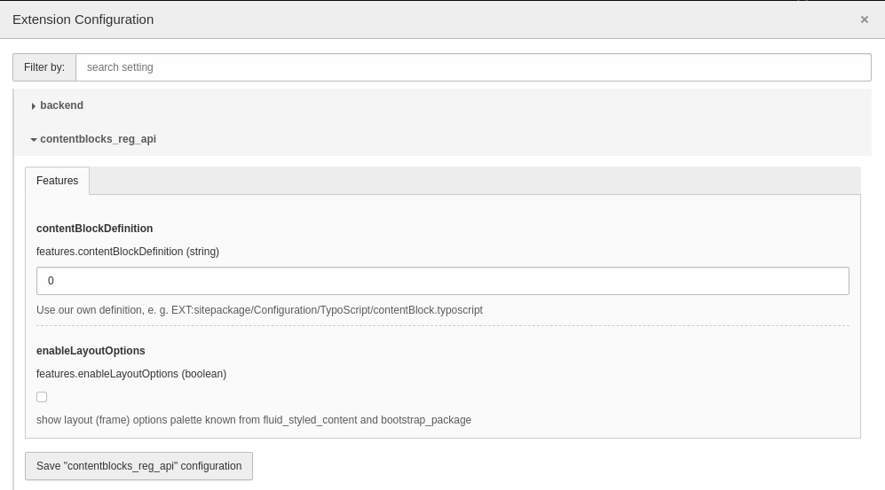

.. include:: /Includes.rst.txt
.. _installation:

=====================================
Installation for using Content Blocks
=====================================

Requirements
============

*  TYPO3 v10+
*  In TYPO3 v10, backend previews require the `Fluid based Page module <https://docs.typo3.org/c/typo3/cms-core/master/en-us/Changelog/10.3/Feature-90348-NewFluid-basedReplacementForPageLayoutView.html>`__ to be enabled.

Installation steps
==================

The API required to use content blocks consists of 2 composer packages: an API
extension and a composer plugin.

#. Run `composer req typo3-contentblocks/contentblocks-reg-api`
#. Activate the extension `contentblocks_reg_api`
#. Add new database fields in your TYPO3 backend:
   :guilabel:`Maintenance > Analyze Database Structure`

.. attention::
   If you use composer >= 2.0, you will need to allow the content blocks composer
   plugin in your projects `composer.json`. Plugins, that are not not explicitly
   allowed, will be blocked. See `here <https://getcomposer.org/doc/06-config.md#allow-plugins>`__
   for more information.

.. code-block:: json

    {
        "config": {
            "allow-plugins": {
                "typo3-contentblocks/composer-plugin": true
            }
        }
    }

Extension configuration
-----------------------

Sometimes it might be necessary to inherit content blocks from your own 
definition (e. g. if you want to inherit content blocks from lib.contentElement).
In that case you can extend the default TypoScript as you need.
This is the default code:

.. code-block:: typoscript

   lib.contentBlock = FLUIDTEMPLATE
   lib.contentBlock {
       layoutRootPaths {
           -5 = EXT:contentblocks_reg_api/Resources/Private/Layouts/
       }

       partialRootPaths {
           0 = EXT:contentblocks_reg_api/Resources/Private/Partials/
       }

       dataProcessing {
           10 = Typo3Contentblocks\ContentblocksRegApi\DataProcessing\CbProcessor
           20 = Typo3Contentblocks\ContentblocksRegApi\DataProcessing\FlexFormProcessor
       }
   }

.. attention::
   If you change the code, you are responsible for that the code is working.
   Beware of data processing. Your content block won't work without that.

You can inject your code via the extension settings in the install tool.
There you can set the default TypoScript to your specific file like
`EXT:sitepackage/Configuration/TypoScript/contentBlock.typoscript`.

The second thing in the extension configuration is to enable the frame pallet
in the appearance section. This might be a helpful feature if you are using
`EXT:fluid_styled_content` or `EXT:bootstrap_package`.

   Extension configuration for EXT:contentblocks_reg_api in "Configure Extensions"
   of backend module "Settings"

Creation/ registration of content blocks
========================================

Via composer
------------

Simply run `composer req typo3-contentblocks/<your-cb-package>:dev-master`

Example:
`composer req typo3-contentblocks/call-to-action:dev-master`

For using custom content blocks in your project we recommend a local "path"
composer repository.

Via GUI (Content Blocks Wizard)
-------------------------------

The registration API offers a simple GUI that helps you defining a content block.

Non-composer mode
-----------------

A content block can also be added manually in `typo3conf/contentBlocks` in
non-composer mode.

Administration
==============

.. attention::
   You will need to allow the generated fields (tt_content,
   tx_contentblocks_reg_api_collection) and CType in the backend user group
   permissions.

Security
========

.. attention::
   You'll need to modify your .htaccess or nginx configuration to secure the src
   folder of your content blocks.

.. tabs::

   .. group-tab:: .htaccess

        In .htaccess::

            # Add your own rules here.
            <If "%{REQUEST_URI} =~ m#^/typo3conf/contentBlocks/.*\.(yaml|html|xlf|json)#">
                Order allow,deny
                Deny from all
                Satisfy All
            </If>

   .. group-tab:: .nginx

        In nginx::

            location ~ (?:typo3conf/contentBlocks)/[^/]+/(?:src?)/ {
                deny all;
            }
